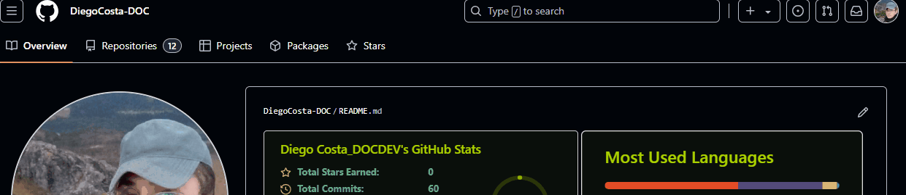

# Projeto com README
Um projeto de teste com um arquivo README 🚀
[](https://google.com)

## Tecnologias utilizadas

- HTML5
- CSS3
- JavaScript

## Como utilizar

1. Clone pro projeto
```
git clone
```
1. Acesse a pasta do projeto
```
cd repositorio-com-readme
```